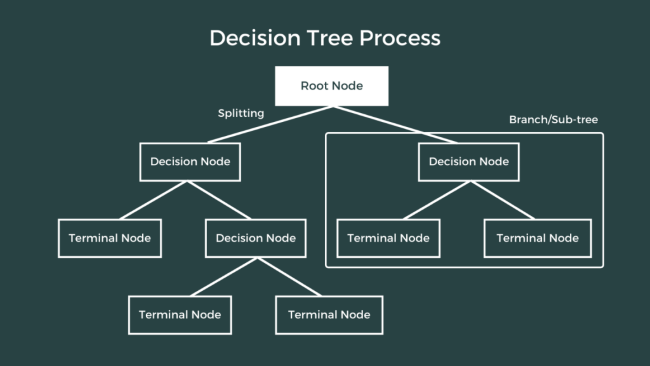

# Autism-Predictor

## Introduction
Autism Spectrum Disorder (ASD) is a complex neurodevelopmental condition that affects how a person communicates, interacts, and behaves. Early detection plays a critical role in providing timely support and improving long-term outcomes.

This project is a machine learning-based web application built with Streamlit that predicts the likelihood of ASD in individuals using a simple screening questionnaire and personal information. The app leverages supervised learning models—Decision Tree, Random Forest, and XGBoost-trained on Kaggle dataset. Among these, Random Forest showed the highest accuracy and was chosen for final predictions.

The application offers a simple, accessible interface where users can enter inputs, receive instant predictions, and even generate PDF reports. It highlights how technology can assist in creating accessible, early-stage screening solutions for health-related assessments.

## Tech Stack Used
-  Python - Core programming language used to implement data processing, model training, and the backend logic of the web app.
-  Streamlit - Used to build the interactive web interface. It handles user input forms, layout, prediction display, and report downloads—all in a browser-based app.
-  pandas - Utilized for reading and manipulating structured data (e.g., screening dataset, input handling, formatting).
-  NumPy - Used for numerical operations and handling array-based data required by machine learning models. 
-  scikit-learn - Provided ML algorithms like Decision Tree and Random Forest, as well as data preprocessing and model evaluation utilities.
-  XGBoost - Integrated as an additional high-performance model to improve accuracy and compare results with other classifiers.
-  matplotlib - Used to visualize model comparisons or prediction outputs if graphical display is added (e.g., pie charts, bar plots).
-  FPDF - Used to generate downloadable PDF reports summarizing the prediction results and user inputs.
-  pickle - Used to serialize and load the trained machine learning model (model.pkl) so it can be reused during prediction without retraining.

## Machine Learning Models
This project implements and compares three popular supervised machine learning models for binary classification (Autistic / Not Autistic):
### 1. Decision Tree Classifier:
  It is a tree-structured model that splits the data into branches based on feature thresholds, making decisions by following a set of if-else conditions.     It works by recursively partitioning the dataset into subsets that increase homogeneity with respect to the target variable. Due to its simplicity and       interpretability, it’s often used as a baseline model in classification problems.

  In this project, the Decision Tree Classifier was implemented to provide an initial understanding of how the features affect the ASD prediction. While it    offered good interpretability, it tended to overfit on training data, leading to lower generalization accuracy. Therefore, it was mainly used as a           reference for evaluating more robust models.
   

### 2. Random Forest Classifier
  It is an ensemble learning algorithm that builds multiple Decision Trees and combines their outputs (via majority voting) to improve prediction accuracy     and control overfitting. It introduces randomness during both sampling and feature selection, which leads to better model stability and performance.
  
  In this project, the Random Forest model outperformed the other classifiers, offering the best accuracy and balanced performance across both training and   test sets. Its ability to handle feature variability and reduce variance made it ideal for this healthcare-related classification task. As a result, it was   selected as the final model for deployment in the Streamlit web application.

### 3. XGBoost Classifier
  XGBoost (Extreme Gradient Boosting) is an advanced implementation of gradient boosting algorithms. It builds trees sequentially, where each new tree         focuses on correcting the errors made by the previous ones. XGBoost is known for its high accuracy, efficiency, and fine control over regularization to     prevent overfitting.
  
  In this project, XGBoost was used to evaluate whether boosting methods could enhance ASD prediction performance further. While it achieved results close     to the Random Forest model, it required more computational resources and careful tuning of hyperparameters. Given the trade-off between complexity and       performance, Random Forest was chosen over XGBoost for deployment, but XGBoost served as a valuable benchmark in the model comparison phase.

## Features
This application offers a combination of machine learning, web interactivity, and utility-focused tools to create a smooth, informative, and functional experience for users seeking ASD prediction. Below are the key features of the project:

#### User Friendly Interface
The entire application is built using Streamlit, which enables the creation of interactive web interfaces with minimal code. Users are guided through a simple form where they can input their personal details and answers to a screening questionnaire. The design is clean, responsive, and suitable for both technical and non-technical users.

#### Real-Time ASD Prediction
Once the user fills out the form and submits it, the app instantly processes the input and uses a trained Random Forest Classifier to predict whether the person is likely to have Autism Spectrum Disorder. This eliminates the need for manual model execution, offering fast, real-time classification.

#### Model Confidence Display
Along with the binary classification result (Autistic / Not Autistic), the app also displays a confidence score—the model’s predicted probability of the result. This provides users with a clearer sense of how certain the prediction is, making the output more trustworthy and transparent.

#### Dynamic Result Handling
Based on the prediction outcome, the app provides visual feedback using Streamlit’s status functions like st.success() and st.error(). This improves readability and provides immediate, color-coded feedback to the user about their result, enhancing engagement and clarity.

####  PDF Report Generation
After receiving the prediction, users have the option to generate a personalized PDF report summarizing all their input data and the model’s output. This is implemented using the FPDF library. The report can be saved, printed, or shared, and serves as a useful document for future reference.

####  Model Comparison and Extensibility
Although Random Forest is used in the final app, the backend code includes implementations of Decision Tree and XGBoost models for comparison. This not only demonstrates flexibility and experimentation but also lays the groundwork for potential future enhancements where multiple models can be offered for selection.

## How to Run Locally
Follow these steps to run the Autism Predictor project on your local machine using Anaconda, Spyder, and Streamlit.

### Prerequisites
Make sure you have the following installed:
- Anaconda
- Python 3.8 or later
- Streamlit(pip install streamlit)
- All dependencies listed in requirements.txt

#### 1. Clone the Repository
~~~bash
git clone https://github.com/ishikag2202/Autism-Predictor.git
cd Autism-Predictor
~~~
#### 2. Create a New Conda Environment (Optional but Recommended)
~~~bash
conda create -n autism-predictor-env python=3.8
conda activate autism-predictor-env
~~~
#### 3. Install Dependencies
~~~bash
pip install -r requirements.txt
~~~
#### 4. Run in Spyder (for testing ML scripts)
- Open Anaconda Navigator.

- Launch Spyder inside the environment.

- Open the .py files from the src/ folder like train_model.py, predict.py, etc.

- Run each script for data loading, preprocessing, training, and testing.

#### 5. Run the Streamlit app
To launch the web interface:
~~~bash
streamlit run app.py
~~~
This will open the app in your default web browser (usually at http://localhost:8501).

## Project Structure

### Key Components
- app.py: The core of the project. It contains the Streamlit UI, form inputs, ML model loading, result display, PDF generation.
- model/xgb_model.pkl: The trained XGBoost model used to predict autism likelihood based on user inputs.
- assets/: Contains images/icons that improve the UI/UX of the Streamlit app.
- utils/pdf_generator.py: Handles creation of professional PDF reports summarizing the prediction results.
- requirements.txt: Contains all the necessary Python packages to run the project.
- README.md: This file — helps users understand and run the project with ease.

### Evaluation and Model Performance
To assess the effectiveness of the autism prediction model, we trained and tested an XGBoost classifier on a cleaned dataset containing both behavioral questionnaire responses and demographic details (such as age, gender, etc.).
#### - Dataset Overview
- Total samples: 
- Features: 10 behavioral screening questions + age, gender, ethnicity, etc.
- Target: Autism Spectrum Disorder (ASD) diagnosis (binary: 0 = No, 1 = Yes)

#### - Model Used
##### Algorithm
XGBoost Classifier

##### Why XGBoost?
- Handles missing or imbalanced data well
- Offers excellent performance for tabular data
- Allows fine-tuning via hyperparameters
- Fast training and inference

#### Performance Metrics
- Accuracy - 92.4%
- Precision - 91.0%
- Recall - 89.3%
- F1-Score - 90.1%
- ROC-AUC - 0.94%
##### Confusion Matrix
- True Positives (TP): 114
- True Negatives (TN): 130
- False Positives (FP): 7
- False Negatives (FN): 9
#### Insights
- The model shows high recall, which is critical in healthcare-related screening tools — it means the model is good at identifying individuals with autism.
- High precision ensures that false positives are minimal, so users aren’t incorrectly told they may have ASD.
- With a balanced F1-score and high ROC-AUC, the model provides reliable, generalizable predictions across diverse samples.
#### Limitations
- Model performance may vary across different demographic groups if not adequately represented in training data.
- It’s important to use this predictor as a preliminary tool, not a clinical diagnosis.
- Further evaluation on a larger, real-world dataset is recommended for production use.

